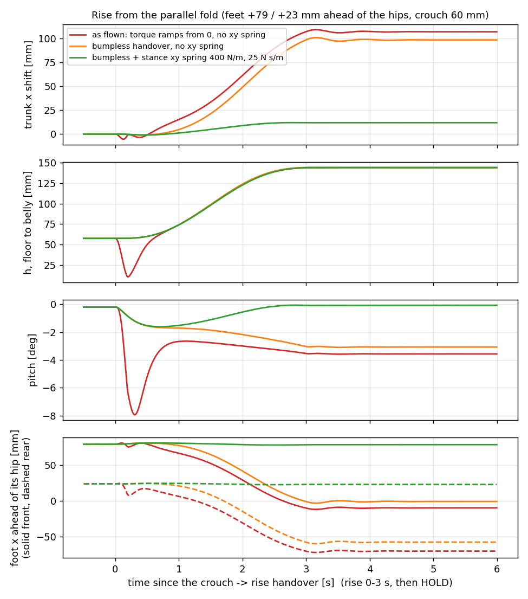
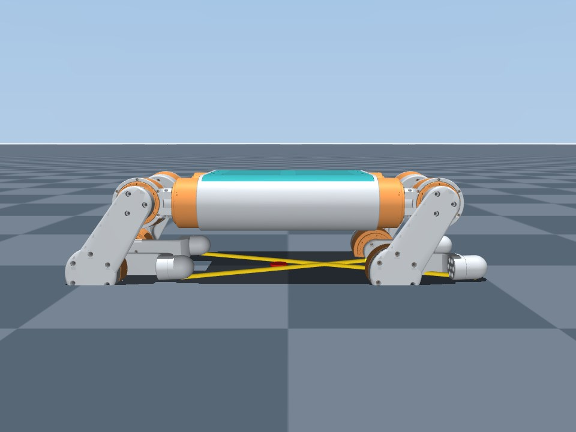
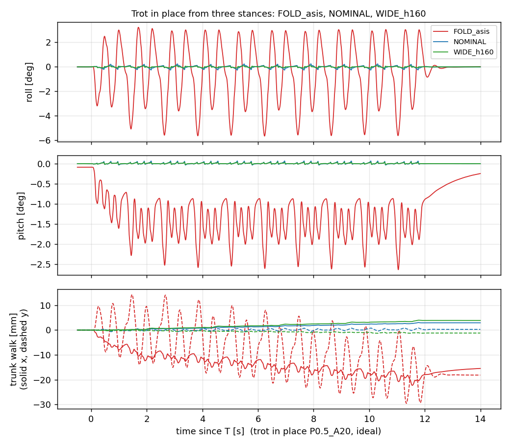
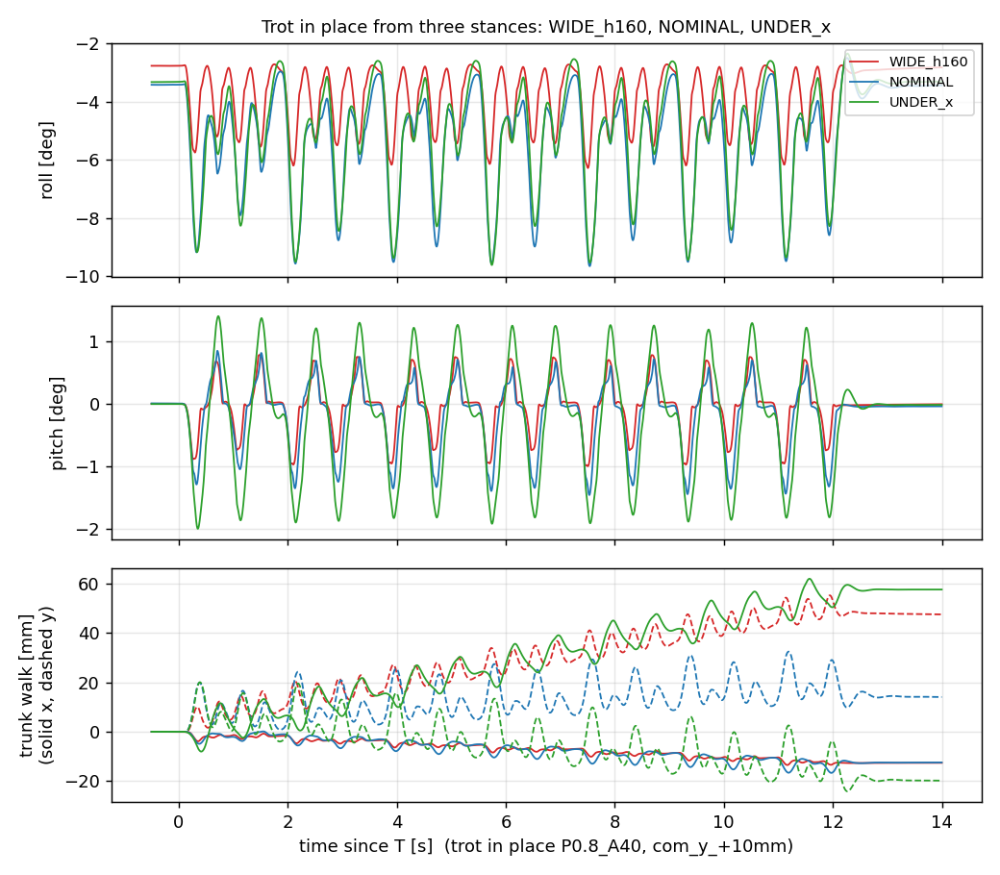
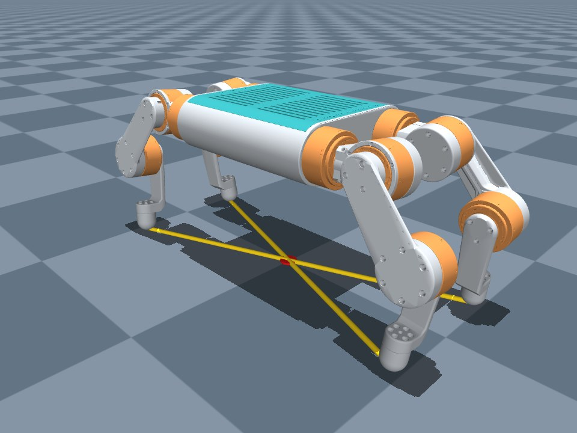

# The stand posture for the trot, and the crouch it rises from

*MuJoCo study, 2026-10-01, against commit 1f9304f.  The repo's own
`StandSequence` / `BalanceLaw` / `TrotGait` / `SafetyGate` run unmodified
through `doc/crouch_trot/hwsim.py` (CAN round-robin timing, encoder and
current quantisation, IMU latency).  Everything here is simulation; the
numbers are what the controller does to the CAD model, not what the robot
did.  Section 7 says how to reproduce.*

**TL;DR.**  The forward shift on the rise is not the handover alone: trunk x
has zero stiffness in this law, and a stance whose four knees all point
back follows a forward path of least dissipation as it rises (~100 mm from
the fold; a mirrored stance 0 mm); the stance xy spring that already exists
(`--kp-stance-xy`) pins it.  The fold crouch itself kneels on its knee
motors (21 mm into the floor in the CAD).  For the trot, every stance whose
diagonals pass through the CoM survives all 13 perturbations in simulation
and today's fold does not; the best usable one is **`posture.WIDE` at
160 mm** (X knees, feet ±81 mm, |y| 85 mm, crouch 40 mm), flyable as
`python -m hw.wide_trot`, with wider tracks (95, 105 mm) as the next step
and lateral CoM calibration worth more than any posture change.

## 1. Why the trunk shifts forward on the rise, and why the legs stop being parallel

The operator's observation: the fold crouch has the front and rear legs
parallel; when the robot rises the trunk slides forward, the front legs end
up compressed, and the stand is no longer the posture that was folded.

**It reproduces in simulation, exactly.**  From `posture.FOLD` (feet +79 mm
ahead of the front hips and +23 mm ahead of the rear hips, crouch 60 mm) with
`hw.fold_stand`'s settings as flown (cap 9 N m, limits off, torque ramping
from zero at the handover):

| | crouch | HOLD |
|---|---|---|
| trunk x, world | 0 | **+107 mm** |
| pitch | −0.2° | **−3.6°** |
| front foot ahead of its hip | +79 mm | **−10 mm** |
| rear foot ahead of its hip | +23 mm | **−70 mm** |



Two things happen, and only the first is the handover:

1. **The handover sag.**  `SafetyGate.start()` restarts the torque at zero
   with a 1 s cap ramp (`hw/safety.py`), so a crouch that the drivers'
   position loops were holding under load (the fold: ~2 N m at each knee)
   is dropped on one sweep.  The trunk falls from 58 to 10 mm and pitches
   −8° before the law catches it (red trace).  A bumpless handover (seed the
   gate with the drivers' reported torque, ramp the cap from there;
   `hwsim.HwParams(prime_gate=True)`, sketch in section 5) removes the sag
   (orange) — and the trunk **still** ends +98 mm forward.

2. **The glide.**  Trunk xy is not regulated by the law (`config.KP_XY = 0`),
   the joint-space hold latches only on reaching HOLD, and the stance xy
   spring (`--kp-stance-xy`, since 2026-09-25) is off by default.  So during
   the rise trunk x is a mode with **zero stiffness**: a 0.3 N push in HOLD
   with the joint layer off moves the trunk 58 mm and it never comes back
   (`data/mech_cpush_nojoint.json`).  It is not a free mode — the joints'
   viscous damping overdamps it — and that is exactly why it drifts: an
   overdamped mode with no restoring force follows the path of least
   dissipation, ẋ = −(M_xz / M_xx) ḣ with M = Σᵢ Jᵢ⁻ᵀ Jᵢ⁻¹, in which the
   damping constant and the rise time cancel.  Integrated along the IK path
   (`scripts/mech_analytic.py`) that predicts the trunk-vs-feet drift to
   within ~10 mm for every stance tried: FOLD from 60 mm 70 (measured 81),
   from 100 mm 50 (57), another parallel stance 74 (67), NOMINAL and the
   knees-inward fold 0 (0).  M_xz vanishes by fore-aft mirror symmetry, so
   a stance whose front and rear legs **mirror** (NOMINAL, WIDE, knees
   pointing away from each other) does not drift; any stance with **every
   knee back** drifts 0.3–1.6 mm per mm of rise.  The checks that ruled the
   alternatives out (`data/mech_results.json`): the drift is the same at
   rise times of 1.5 / 3 / 6 / 12 s (94 / 98 / 95 / 90 mm) while the ground
   impulse falls to zero, so it is not an inertial bias; armature → 0
   changes it by 2 %; a 1 kHz near-zero-latency loop changes it by 6 %;
   joint Coulomb friction 0.1 / 0.3 / 1.0 N m gives 46 / 43 / 39 mm (a floor
   of its own, rate-independent — on the robot the gearboxes supply both
   kinds of loss, which is why it shows "sometimes" and by varying amounts).

With the bumpless handover **and** the stance xy spring (green), the fold
rises with the feet where the crouch put them: trunk-vs-feet 5.0 mm at
25 N/m, 1.9 at 50, 1.2 at 100, 0.7 from 300 up (all with kd = kp/16).  The
spring acts on all four feet throughout the rise (`law.py` 669-682:
`clock_now` is None outside a trot) and pins each foot's hip-frame xy at
the crouch's value while h ramps — the "same posture at the top as at the
bottom" the fold was meant to give.  What no gain removes is the ~12 mm
the trunk and feet move *together*: the 15 mm foot balls roll R·Δθ ≈ 11 mm
as the shins rotate from the crouch to the stand (6 mm from a 100 mm
crouch; ±4 mm cancelling front/rear in NOMINAL) and the law tracks the ball
centre.  The spring does nothing for the sag: with the ramp-from-zero
handover the trunk still falls to h = 10 mm at any gain.

Two consequences the code has today (from `hw/balance/sequence.py`):
the joint-hold target is latched from the *measured* joints on the sweep
the ramp arrives (line 747), so whatever the rise did is frozen into the
hold and every trot; and the park is a joint-space ramp back to
`crouch.q` from wherever the hold is (813-816) with `feet_home` judged from
the law's bookkeeping, not a measurement (481-486), so after a 100 mm glide
the park drags four loaded feet ~100 mm across the floor.

## 2. The fold crouch kneels on its knee motors

The knee is driven by an MG5010 on the knee hinge, a disc of radius 32 mm in
the leg plane (`sim/model/meshes/MG5010-i10_plane.stl`).  The committed
FOLD crouch puts the knee hinge 11 mm above the floor.  A mesh-level check
(`evalpose.collisions`: a copy of `dog6.xml` compiled with every CAD mesh
collidable, convex hulls, 30 mm reporting margin) at that crouch shows the
knee motors **21 mm into the floor** and the front thighs 0.1 mm from the
abduction motors.  The real robot therefore rests on its knee motors and
thighs in the fold crouch, the drivers hold less than the law assumes, and
the handover starts from a pose the model never had.  The plant simulation
collides only the trunk box and the foot balls, so the 09-17 study and every
`hwsim` run before today flew through it.



With the knee motors 3 mm clear of the floor and every link 5 mm clear of the
trunk, the lowest crouch for the fold's feet is 114 mm — because the
knee-back front thigh closes on the abduction motor as the trunk drops.
That is a property of the parallel fold on DOG6's geometry (pitch hinge
28 mm outboard of the abduction hinge, 100 mm thigh), see section 4.

## 3. Method

`evalpose.py` builds a candidate from five numbers and a knee family —
`FAMILY XF XR Y H`: the knee branch (`parallel`: every knee behind its hip,
the fold; `x`: front knees forward, rear back, the CAD stand / NOMINAL;
`xin`: knees toward the CoM), the foot's x ahead of its own hip (front,
rear, mm), the half-track |y| (mm) and the stand height floor-to-belly (mm)
— solves the IK on that branch, pins the SRB model at *that* height, finds
the lowest crouch that obeys the clearance rules above, and scores it:

* statics at a level trunk: the allocator's split and Jᵀ torques on four
  feet and on each diagonal pair, the CoM's distance to each diagonal
  support line (`sim.kinematics.body_inertia` at the pose), inertia, reach;
* the stand: `hw.fold_trot`'s run (cap 9, slew 60, roll 290/23, no limits,
  Cartesian swing, joint hold 5/0.2) with a bumpless handover and the stance
  xy spring 400/25 — drift, pitch, torque peaks;
* the trot in place for 12 s at 0.5 s / 20 mm (the operator's best fold
  trot) and 0.8 s / 40 mm (`hw.trot`'s clock), under the 13 perturbations of
  `doc/crouch_trot/robustness.py` (IMU latency 15/30 ms, CoM ±5/10 mm,
  joint friction 0.1/0.3, foot µ 0.5, kt 0.85, +0.4 kg, 1 ms compute, a
  mild combination) — fell / max tilt / walk / torque.

`scripts/grid_sweep.py` ran the statics over 1512 specs (3 families ×
7 × 8 foot offsets × 3 tracks × 3 heights); `data/grid_table.csv` has them
all, `data/grid_shortlist.json` the 16 chosen for dynamics, `data/cand_*.json`
the dynamics.

## 4. Results

28 candidates were simulated (`data/candidates_summary.json`; `python
scripts/summarize_cands.py` prints the table).  **Every stance whose two
diagonals pass through the CoM survives all 13 perturbations at both
clocks.**  Today's fold (CoM 20.5 mm off both diagonals) survives the 0.5 s
/ 20 mm trot with 5.7° of per-swing rocking (12.5° with a 10 mm CoM error)
and falls within 1.7 s at 0.8 s / 40 mm, every time: the first diagonal
loads, the trunk rolls about it as an inverted pendulum, and the allocator
is asked for a moment two feet on one line cannot make.



Among the centred stances the discriminator is the **worst case**, which is
the same for all of them — a 10 mm lateral CoM error — and shows up as a
steady roll offset of about 3° (the attitude PD has no integrator) plus a
per-swing dip of 1–2°:



| stance (family, feet xf/xr, \|y\|, h) | crouch mm | rise drift | hold N m | diag-pair N m | survived 0.5 / 0.8 | worst tilt 0.5 / 0.8 | ideal tilt | knee from straight |
|---|---|---|---|---|---|---|---|---|
| **FOLD as flown** (parallel, +79/+23, 71, 145) | 60 (kneels) | +12 (+107 without the fix) | 1.47 | 2.85 | 13/13 / **0/13** | 12.5 / — | 5.7 / 12.1 | 65° |
| NOMINAL (x, +81/−81, 65, 145) | 0, floor rest | 0 | 0.42 | 1.20 | 13/13 / 13/13 | 7.4 / 9.7 | 0.26 / 0.56 | 65° |
| WIDE (x, +81/−81, 85, 145) | 40 | 0 | 0.39 | 1.19 | 13/13 / 13/13 | 5.5 / 8.0 | 0.21 / 0.20 | 63° |
| **WIDE at 160** (x, +81/−81, 85, 160) | 40 (14 possible) | 0 | 0.38 | 1.25 | 13/13 / 13/13 | 4.5 / 6.3 | 0.11 / 0.14 | 45° |
| wide 95 at 160 (x, +81/−81, 95, 160) | 40 (18 possible) | 0 | 0.48 | 1.24 | 13/13 / 13/13 | 4.1 / 5.4 | 0.09 / 0.12 | 43° |
| wide 105 at 160 (x, +81/−81, 105, 160) | 40 (17 possible) | 0 | 0.62 | 1.24 | 13/13 / 13/13 | 3.8 / 4.8 | 0.08 / 0.12 | 40° |
| WIDE at 175 (x, +81/−81, 85, 175) | 14 | 0 | 0.39 | 1.35 | 13/13 / 13/13 | 3.2 / 4.4 | 0.08 / 0.11 | **14°** (rejected) |
| feet under the hips (x, 0/0, 65, 145) | 66 | 0 | 1.08 | 2.07 | 13/13 / 13/13 | 7.1 / 9.6 | 0.31 / 0.40 | 71° |
| fold re-centred (parallel, +80/−110, 71, 145) | 112 | +3 | 1.11 | 2.25 | 13/13 / 13/13 | 7.1 / 8.9 | 0.90 / 0.63 | 65° |
| best parallel (parallel, +60/−86, 85, 160) | 140 | +2 | 0.84 | 1.71 | 13/13 / 13/13 | 5.0 / 6.3 | 0.37 / 0.34 | 52° |
| knees inward (xin, +79/−79, 71, 145) | 114 | 0 | 1.13 | 2.24 | 13/13 / 13/13 | 6.5 / 9.3 | 0.58 / 0.74 | 65° |

What the sweep says (full table in `data/candidates_summary.json`, statics
over 1512 specs in `data/grid_table.csv`, the analyst's and judge's notes in
`data/ranking.md`):

* **Centring is the first filter.**  For the mirrored families it is exact
  on xr = −xf (the whole-robot CoM sits at the hip midpoint); for the
  parallel family the leg mass behind the feet moves the CoM 10–17 mm back,
  so a centred parallel stance needs the rear foot at −(xf + 30) mm — a
  485–503 mm wheelbase — and it still cannot crouch below ~110 mm without
  resting on the knee motors or the abduction motors.
* **Track and height buy roll margin**, about 0.08° per mm of half-track and
  0.10° per mm of stand height at 0.8 s / 40 mm, with the hold torque flat
  until the abduction joints start carrying it (|y| 105: 0.62 N m).  Height
  is capped by the knee: at 170 mm the knee is 28° from straight, at 175 mm
  14°, and the vertical Jacobian is near-singular (1 N m of knee torque is
  78 N of vertical force at 14°, 18 N at 63°).  The simulated stands also
  sag 1–7 mm below command, growing with height, so the 175 mm rows really
  flew at 168 mm.
* **Foot x hardly matters for the tilt** (x = 60 / 81 / 100 give 6.3 / 6.3 /
  6.2° at |y| 85, h 160) but sets the torque and the crouch: ±81 mm (NOMINAL's
  vertical-shin geometry) is the hold-torque minimum and the only x with a
  floor-resting crouch; ±60 has the lowest diagonal-pair torque (0.78 N m)
  but its crouch sits 0.1° from the soft limit; feet under the hips cost
  2–3× the knee torque and make a fore-aft CoM error the second-worst case.
* **The knee family dominates the rest.**  At equal track and height the
  parallel and knees-inward families match the X family on worst tilt but
  cost 2–3× the hold torque, 2.4–3.1 N m trot peaks against 1.5–2.2, a crouch
  of 112–142 mm, +0.3 to +1.9° of friction sensitivity, a 2–4 mm rise drift
  and a backward walk.
* **A skeptic with the simulator could not overturn the order** (`data/`:
  spring off, joint hold off, today's handover, SRB pinned at 145 flown at
  160, a 25 s trot, friction + 30 ms latency + 0.85 kt together, a 0.6 s /
  30 mm clock, a 15 mm CoM error): the winner never falls and the gaps
  widen under harder perturbations.  It did find one real blind spot: with
  today's ramp-from-zero handover the trunk sags ~8 mm, and from a crouch
  of 14–25 mm that puts the left and right knee motors into each other —
  so the wide stances keep the **40 mm crouch** (`data/hw_checks.json`:
  ≥ 23 mm of knee-to-knee clearance after the sag, 0.5–0.7 N m to hold).

## 5. Recommendation

**Stand:** the X configuration the CAD was drawn in (front knees forward,
rear knees back — `posture.NOMINAL`'s legs), feet 81 mm ahead of the front
hips and 81 mm behind the rear hips, **|y| 85 mm (the WIDE track), 160 mm
floor to trunk bottom**, i.e. `posture.WIDE` flown at `--height 160`.  It
is the smallest change from what the robot already flies that captures the
gain, and it needs no new posture: `hw/wide_trot.py` is `hw.fold_trot`'s
run with this posture, the SRB re-pinned at the flown height, roll 290/23,
limits off, the stance xy spring on, 0.5 s / 20 mm.

**Crouch:** the WIDE crouch at 40 mm (trunk in the air, the 0xA4 loops hold
~0.5 N m at the knees), reached from the flat zero exactly as WIDE was on
2026-09-17..21.  It is load-bearing, so the handover sag of a few mm is
real (the belly is 40 mm up and the knee motors clear each other by 23 mm
even after an 8 mm sag); `posture.NOMINAL` (|y| 65) is the only one of
these that rests on the floor at zero torque, at the cost of ~1.5° more roll
in the worst case.



```
python -m hw.wide_trot --fake --auto 1 --no-imu       # the whole path, no robot
python -m hw.wide_trot --log wide.npz                 # 160 mm, 0.5 s / 20 mm, spring on
python -m hw.wide_trot --period 0.8 --swing-height 40 # hw.trot's clock
python -m hw.wide_trot --track 95                     # feet 10 mm further out
```

**In order of expected gain on the robot:**

1. Fly `hw.wide_trot` (or `hw.trot` with `--height 160 --kp-roll 290
   --kd-roll 23 --kp-stance-xy 400 --kd-stance-xy 25` for the |y| 65
   version).  Confirm the stand is repeatable: the feet must be where the
   crouch put them, the trunk level, no forward shift.
2. Calibrate the lateral CoM and re-centre the stance (the 09-17 study's
   CoP method): a 10 mm lateral error is worth ~6° of roll in this model,
   while every posture change above is worth 1–2°.  The test that separates
   the two: strap ~300 g at 200 mm off the centreline and trot in place; the
   model predicts 4.5° (0.5 s) / 6.3° (0.8 s) of roll for WIDE at 160 and a
   slow walk toward the mass.
3. If more roll margin is wanted after that, `--track 95` or `105` (built
   from NOMINAL the way WIDE is, crouch 40): 4.1 / 5.4° and 3.8 / 4.8° in the
   model, for 0.48 / 0.62 N m of abduction torque in HOLD.
4. If the fold is to be kept for any reason, it needs the stance xy spring
   on during the rise, a crouch at ≥ 100 mm (or an admitted kneel), the
   rear feet at −110 mm to centre the CoM, and the 0.5 s / 20 mm clock; it
   will still cost 2–3× the torque.  The bumpless handover
   (`SafetyGate.start` seeded with the drivers' reported torque, cap ramped
   from that level — sketch in `data/` from the law agent, in
   `doc/crouch_trot` as `prime_gate`) removes the sag for every
   load-bearing crouch and is worth doing regardless.

## 6. Limitations

* The plant collides only the trunk box and the foot balls; link contact is
  checked statically (section 2) but a trot that swings a knee into the
  floor would not be caught.
* CAD masses, a perfect IMU (sampled and delayed only), no gear friction or
  backlash unless perturbed, the 0xA4 position gains unknown (sim.stand's).
* The swing's armature is DOG5's (not measured on DOG6, `swing_bench`),
  so apex tracking on the robot differs from the sim's.
* Trot runs are 12 s, in place; survival is not an infinite-horizon claim.
* The bumpless handover and the stance xy spring are assumed on; the stance
  spring is a flag today, the bumpless handover is a sketch (section 5).

## 7. Reproduce

`data/` is git-ignored, as everywhere in this repo: the numbers above are
quoted, and the commands below regenerate every file this README names
(`evalpose.py run ... --perturb all` writes `data/cand_NAME.json`;
`scripts/summarize_cands.py` then writes `data/candidates_summary.json`).
`evalpose.py` imports the 2026-09-17 harness, `doc/crouch_trot/hwsim.py`,
`robustness.py` and `fixes.py`.

```
V=D:\mujoco\.venv\Scripts\python.exe        # from the repo root
$V doc/trot_posture/evalpose.py describe NAME FAMILY XF XR Y H
$V doc/trot_posture/evalpose.py run NAME FAMILY XF XR Y H --clocks 0.5:20 0.8:40 --perturb all --keep-npz
$V doc/trot_posture/scripts/grid_sweep.py && $V doc/trot_posture/scripts/grid_merge.py
$V doc/trot_posture/scripts/render_pose.py NAME FAMILY XF XR Y H
$V doc/trot_posture/scripts/fig_drift.py ; $V doc/trot_posture/scripts/fig_trot_compare.py
```
