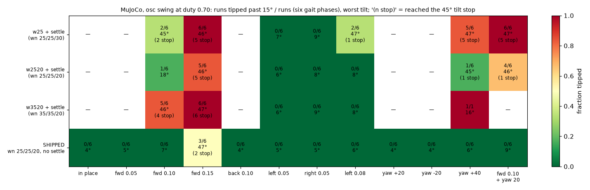
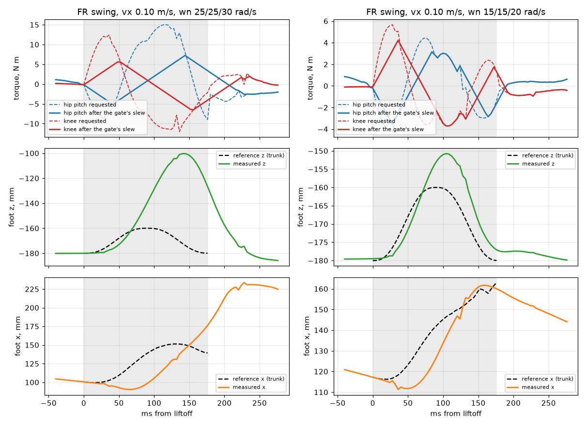

# Walking from the fold stand: one reference, the joint layer kept, the QP

*MuJoCo study, 2026-10-04, branch `cloud`.  The repo's own `StandSequence` /
`BalanceLaw` / `TrotGait` / `SafetyGate` run through
`doc/crouch_trot/hwsim.py` (CAN round robin, encoder quantisation, the 40 Hz
qd filter, IMU latency, the gate's 120 N·m/s slew and 9 N·m clip), with
`hw.trot_esti`'s Kalman filter fed **one sweep late** as `hw.stand` does.
The operator "holds keys": the command comes from a schedule.  Everything
here is simulation on the CAD model with DOG5's rotor inertia; **nothing has
flown**.  Section 9 says how to reproduce every table.*

**TL;DR.**  `hw.fold_walk` walks `hw.fold_trot` from the keyboard (W/S x, A/D
y, Q/E yaw) with the joint layer **kept**: its stance targets are anchored in
the world at each touchdown and seen from the *reference* trunk, so along
the reference they ask for exactly zero torque and they pull only on the
error the x/y rows pull on (section 2: the proof, and `selftest` §14).  The
force allocation is a QP with the friction pyramid inside the problem
(section 5), checked against SLSQP and certified by KKT.  **MuJoCo says it is
feasible inside a modest envelope**: across six gait phases a case the
shipped walk stays under 10° of tilt — in place, forward and back
0.05–0.10 m/s, sideways ±0.05 and 0.08 m/s, turns of ±20 and 40 °/s, 0.10 m/s
with a 20 °/s turn — and **0.15 m/s forward is not** (3 of 6 tipped, 2 to the
tilt stop).  Getting there took three findings worth more than any gain:
(1) the swing leg is **torque-rate bound** — in z the foot is 5.8 kg through
the reflected rotor, so the 20 mm arc's own feedforward asks the knee for
~1 000 N·m/s at the trot's 120 ms of swing and ~300 at 180 ms, against the
gate's 120: hence duty 0.70 and a swing law stiff in x/y, soft in z;
(2) DOG5's **settle** (a 0.2 s freeze of the gait clock every 2 cycles) must
be **off** while walking; (3) the **armature is the swing law's gain** — with
DOG6's lighter rotor (the bench's 1/1.7) and DOG5's M0 the walk fell 1 time
in 3 at 0.10 m/s, and with M0 fitted it never did.  The estimator under-reads
distance by ~10 %, so the robot walks ~10 % faster than asked.  The keys'
box ships at 0.10 / 0.05 m/s and 20 °/s.



## 1. What was built

```
keys ──► WalkKeys.command (body axes) ──► WalkReference ──► RefSample (p, v, a, ψ, r) ──┬─► x/y rows (p_ref, v_ref, a_ref)
 W/S x  A/D y  Q/E yaw  SPACE stop       slew · clip · integrate · leash                ├─► heading (R_des = Rz(ψ_ref)…, ω_des = r ẑ)
                                                                                         ├─► joint layer (world-anchored targets)
                                                                                         └─► footholds + swing arc ─► swing law
                         SRB wrench ──► QP allocation (pyramid + box inside) ──► −Jᵀ Rᵀ f + gravity
```

| file | what it is |
|---|---|
| `hw/balance/trajectory.py` | the reference: `sim.cmpc.trajectory`'s generator **imported** (body command rotated by the *reference* yaw, integrated), the command slewed at `WALK_ACC_MAX`, clipped to the hardware box, **leashed** to the filter's CoM (MIT's `max_pos_error`) and the yaw to the IMU's heading on the circle |
| `hw/balance/keys.py` | `sim.cmpc.run`'s mapping key for key: W/S ±x, A/D ±y, Q/E ±yaw, SPACE stop; accumulates, clips |
| `hw/balance/qp.py` | stage 4 as a QP: `min ½|Af − b|²_S + ½α fᵀWf` s.t. the pyramid and the contact-weighted fz box; dense primal active set |
| `hw/balance/footstep.py` | the swing leg's **trajectory**: eq (33) + Raibert's term for the foothold, the x/y arc a quintic in the **world** (ground speed at both ends), z the in-place bump in the trunk |
| `hw/balance/swing_control.py` | the swing leg's **control**: task-space computed torque (`osc`, the default) or the Cartesian impedance |
| `hw/balance/walk.py` | ties them to one reference; the joint layer's world-anchored targets |
| `hw/fold_walk.py` | the entry point: `hw.fold_trot` + the hook + the QP + the walk's clock |
| `doc/walk/walksim.py` | this study |

`law.BalanceLaw` gains `alloc` (`"wls"` default, `"qp"`) and `walk` (None
default).  With both at their defaults nothing changes for any other entry
point: `selftest` still passes the 317 checks it passed before (the same two
fail, section 9), and 53 new ones in its section 14.

## 2. One reference — and why the joint layer survives walking

The worry (2026-10-04, before any of this was written): a joint target
latched at HOLD is a stance; the SRB law moving the trunk to correct x/y
deforms that stance; the two fight.  They do — *if their targets differ*.
The cure is not to drop the layer but to give it the same target as
everything else.

Each planted foot *i* has a **world anchor** `a_i` (x/y), latched at its
touchdown from the filter: `a_i = p̂ + R x_i^b`.  With the reference trunk
origin `p_o(t) = p_ref − Rz(ψ_ref) c_xy` (the CoM reference less the CoM
offset) the joint layer's target is the foot *as the reference trunk sees
it*:

```
x_t,i  = Rz(ψ_ref)ᵀ (a_i − p_o)          z: the commanded stance depth
ẋ_t,i  = −Rz(ψ_ref)ᵀ ṗ_o − r ẑ × x_t,i     (the anchor is fixed in the world)
q_t,i  = IK(x_t,i),   q̇_t,i = J_i⁻¹ ẋ_t,i
τ_i    = Kp (q_t,i − q_i) + Kd (q̇_t,i − q̇_i)       planted legs only
```

**Claim 1 — along the reference the layer is silent.**  If the trunk is
exactly on the reference — origin at `p_o`, heading `ψ_ref`, at their rates,
level and at the commanded height — and the foot has not slipped, the foot's
trunk-frame position *is* `x_t,i` and its rate *is* `ẋ_t,i`, so `q = q_t`,
`q̇ = q̇_t` and `τ = 0`.  (Roll, pitch and height errors still meet the
spring, as they always did: those are the attitude and height loops'
errors too.)  The layer therefore acts
only on the trunk's deviation from the reference — the same deviation the
x/y rows act on, measured the same way — so the two can no longer disagree
about where the trunk should be.  This is the conflict of the "joint hold
vs. SRB correction" question, removed by construction rather than by
softening either loop.  (`selftest` §14 builds a trunk 12 mm and 5° off the
engaging pose, moving at 0.1 m/s and 0.2 rad/s, sets its joints from an
independent finite difference of the reference's motion, and finds the
spring and the damper both zero to 1e-9 rad and 1e-10 rad/s.)

**Claim 2 — engaging is bumpless.**  At the first trot sweep every foot is
still on its HOLD site.  The anchors are set *virtually* to
`p_eq + Rz(ψ₀) s_i` with `s_i = FK(q_hold)` and `p_eq` the least-squares
origin that puts the four feet on their sites; the reference is reset on
the same `p_eq`.  So on that sweep `q_t ≡ q_hold` (to 9e-16 rad in
`selftest`) and the x/y error is zero — no step in the joint torque, none in
the wrench.

Two bounds keep an estimate gone wrong from pulling hard: the reference is
leashed within 30 mm of the filter's CoM, and per leg the x/y part of
`x_t − x` is clamped to 20 mm (`HOLD_XY_ERR_MAX`; at Kp 5 that is a few N).

The heading takes the same sample: `R_des = Rz(ψ_ref)·R(roll_sp, pitch_sp)`,
`ω_des = r ẑ`; the x/y rows get `p_ref`, `v_ref` and `a_ref` fed forward
(only while they are closed on a usable estimate).

## 3. Footholds and the swing arc

The foothold is cMPC's eq (33) with Raibert's feedback term, in the run's
world at the predicted touchdown (`t_rem` = swing time left):

```
p_land = p̂ + v_ref t_rem + Rz(ψ̂ + r t_rem + ½ r T_st) s_i + ½ T_st v̂ + k_v (v̂ − v_ref)
```

clamped to ±(60, 40) mm of the site in the heading frame.  `s_i` is the
**stance's own** neutral foot (the hold's), not the hip: the stance the SRB
model is pinned at.  `½ r T_st` is MIT's `pYawCorrected`.  `k_v` = 0.03 s
(MIT's); 0.06 and 0.10 were worse (section 6.2).

The arc is split on purpose: **x/y is a quintic between two world points**
(liftoff latched where the foot *is*, landing re-aimed every sweep), so the
foot leaves and meets the floor at ground speed — a trunk-frame arc would
slide every landing at the walking speed.  **z stays the in-place bump** on
the commanded depth, in the trunk, where the height loop and the joint
layer live.  World → trunk is by the heading, with the transport terms
(`v_b = Rzᵀ(v_w − v) − r ẑ × p_b`, `a_b = Rzᵀ(a_w − a) − 2r ẑ × v_b + r² p_b`);
`selftest` checks both against finite differences, walking and turning, and
the scalar arcs against `sim.cmpc.swing.SwingTrajectory` to 9e-15.

## 4. The swing law, and the number that decides it

```
osc:        τ = M0 J⁻¹ (a_ref + ωn² e + 2ζωn ė − J̇ q̇)        (cMPC's law, constant M0)
impedance:  τ = Jᵀ (Kp e + Kd ė)  [+ M0 J⁻¹ (a_ref − J̇ q̇_ref)  with --swing-ff]
```

The task-space law gives every axis its own bandwidth whatever the foot's
apparent mass, and that mass is the whole story.  At the fold stance,
`Λ = (J M0⁻¹ Jᵀ)⁻¹` has a diagonal of **0.31, 0.36, 5.8 kg** (x, y, z): the
reflected rotor, 0.0085 kg·m² a joint, seen through a short z lever.  The
20 mm z bump is two quintic halves of `T_h = T_sw/2`; its peak jerk is
`60 H / T_h³`, so its *feedforward alone* asks of the knee

| swing | z peak jerk | knee torque rate (feedforward only) | gate |
|---|---|---|---|
| 120 ms (duty 0.80) | 5 560 m/s³ | ~1 020 N·m/s | 120 |
| 180 ms (duty 0.70) | 1 650 m/s³ | **~300 N·m/s** | 120 |
| 245 ms | 650 m/s³ | ~120 N·m/s | 120 |

(`M0 J⁻¹ ẑ` is 0.18 N·m per m/s² at the knee.)  Past the gate's slew the
torque the motor gets is a triangle of the one asked for, the foot lags,
the feedback winds up behind the limiter, and the foot overshoots:



*FR, 0.10 m/s forward.  Left, ωn 25/25/30: the law asks 12–15 N·m, the gate
passes 120 N·m/s ramps, and the foot rises 80 mm for a 20 mm apex and lands
60 mm long.  Right, ωn 15/15/20: the request peaks near 5.5 N·m and the foot
follows within ~10 mm.*

So the lower bound on the swing time at the gate's slew is
`T_sw ≥ 2 (60 H κ / Ṫ_max)^(1/3)` = 245 ms at H = 20 mm (κ = 0.18 N·m s²/m).
The upper bound comes from the other side of the trot: each diagonal stands
alone for `T_sw`, and about its own support line it can make **no moment at
all** (forces at points on a line have zero moment about that line); the
trunk is an inverted pendulum there with `τ = √(h/g) ≈ 0.13 s`.  Lengthening
the swing to fit the slew lengthens the time the trunk falls about the
diagonal.  Duty 0.70 at 0.6 s (180 ms) and a low z bandwidth is where the
two meet in these runs; `--period 0.8` (240 ms) helped at 0.15 m/s once
(`h_fwd15_p08`) and nowhere reliably.

**The armature is the osc law's gain.**  M0 carries DOG5's rotor; the
bench's swing-ff run (2026-09-25) read DOG6's as ~1/1.7 of it.  Section 6.6
flies that plant.  Fit it (`hw.swing_bench --analyse`) and pass
`--ff-armature`.  The impedance (`--swing-law impedance`) does not read M0
without `--swing-ff`, but it is no way round this: in the shipped walk it
fell at 0.10 m/s (section 6.5).

## 5. The QP

```
min_f  ½ |A f − b_d|²_S + ½ α fᵀ W f          S = I, α = 1e-4, W = (10, 10, 1) / w_i
s.t.   |fx_i|, |fy_i| ≤ μ fz_i                 the pyramid, μ = 0.5
       w_i fz_min ≤ fz_i ≤ w_i fz_max          the contact ramp's box
       f_i ≡ 0 for w_i < 1e-3                  (not a variable)
```

`allocation.allocate` solves `A f = b` by weighted least squares and *then*
clips into the cone and rescales; the QP puts the cone and box in the
problem, so the delivered wrench is the closest the cone can make.  With
every face slack the two are the same allocation to α's regularisation
(0.01 N of 57.7 in `selftest`); on a 27 N push the least squares' clip
leaves a 11.7 N residual and the QP 0.12.

The solver is a dense **primal active set** (Nocedal & Wright, Alg. 16.3):
OSQP is not on the Pi and an ADMM's iteration count is the wrong shape for a
slot.  Most sweeps touch no face, and then the unconstrained optimum — one
12×12 solve — *is* the answer (checked first; ~65 µs against the least
squares' ~100 on this machine).  Otherwise it starts from that optimum
**projected into the cone** with the clipped rows as the working set (a
warm start from the last sweep was measured worse: 9.8 iterations mean / 38
max on the hardest sweeps of a walk, against 3.2 / 13).  Every iterate is
feasible, so the cap (30) can only cost optimality.  Degeneracy is handled
structurally: a foot's opposite faces can never both be active above the fz
floor, so the working set keeps one row of each pair; feet below the 1e-3
weight leave the problem (their collapsing box was what cycled).

Verification: on 77 captured hard sweeps and 3 000 random wrenches / stances
/ ramps, the forces agree with SLSQP to 1e-4 N, never violate a constraint,
never hit the cap (worst 26 iterations); `selftest` §14 certifies 400 more
by KKT (stationarity 8e-11, every multiplier ≥ 0).

## 6. What MuJoCo says

Columns: *tipped* is any tilt past 15° (the harness's "fell"); *tilt stop*
is the fold stand's own 45° e-stop, i.e. on the floor.  *True* velocity is
the trunk's, from MuJoCo, over the steady second half of the 5 s command.

### 6.1 The first design: the walking impedance at the trot's clock

`--v0`: the walking impedance (`KP_SWING_WALK` 150/150/400) at the trot's own
duty 0.80 (120 ms of swing), the trot's settle, everything else as shipped.
`inplace_flown` is `hw.fold_trot` with nothing of the walk attached.

| scenario | command (vx, vy, r) | stood | true (vx, vy, r) | max tilt | peak τ | slip |
|---|---|---|---|---|---|---|
| `inplace_flown` | in place | yes | — | 2.2° | 1.34 N·m | 9.4 mm/s |
| `v0_inplace` | in place | yes | — | 2.5° | 1.26 N·m | 8.5 mm/s |
| `v0_fwd05` | +0.05, +0.00, +0°/s | yes | +0.040, -0.002, +0.6 | 6.2° | 6.51 N·m | 42.5 mm/s |
| `v0_fwd10` | +0.10, +0.00, +0°/s | yes | +0.063, -0.004, +0.6 | 13.6° | 8.36 N·m | 80.4 mm/s |
| `v0_back10` | -0.10, +0.00, +0°/s | yes | -0.106, -0.002, -0.4 | 4.0° | 2.65 N·m | 29.8 mm/s |
| `v0_lat05` | +0.00, +0.05, +0°/s | **fell** | — | 46.3° | 5.65 N·m | 23.4 mm/s |
| `v0_yaw20` | +0.00, +0.00, +20°/s | yes | +0.001, +0.009, +19.8 | 5.0° | 2.90 N·m | 27.2 mm/s |
| `v0_fwd10_ff` | — | **fell** | — | 46.2° | 9.00 N·m | 88.0 mm/s |
| `v0_fwd10_osc` | +0.10, +0.00, +0°/s | **fell** | — | 45.4° | 9.00 N·m | 73.1 mm/s |
| `v0_fwd10_d70` | +0.10, +0.00, +0°/s | yes | +0.082, -0.009, +1.8 | 9.8° | 8.03 N·m | 83.2 mm/s |

The walk attached at zero command is the trot in place it replaced (2.5°
against 2.2°).  Moving, it is not a walk: 0.10 m/s forward makes 0.063 at
13.6°, sideways falls, and neither the feedforward (`_ff`) nor the
task-space law at the same clock (`_osc`) rescues it; a longer swing alone
(`_d70`, duty 0.70) does better.  Section 4 is why.

### 6.2 Why: the swing is torque-rate bound

Section 4.  The one-knob sweep at 0.10 / 0.15 m/s on the osc law at duty
0.70 (`--sens`, ωn 25/25/30 otherwise):

| knob | 0.10 m/s | 0.15 m/s |
|---|---|---|
| none (`g_fwd10` / `g_fwd15`) | tilt 12.2°, τ 9.0 (the clip) | fell |
| gate slew 240 / 360 N·m/s | 8.5° / 10.0° | fell / fell |
| ωn 15/15/20 | **6.6°, τ 5.2** | fell |
| k_v 0.06 / 0.10 s | 11.6° / fell | fell / fell |
| apex 30 mm | fell | fell |

### 6.3 The swing's gains, by axis, across the gait phase

One run is one gait phase at the command, and the outcome flips with it.
Each case six times, the command 0, 100, … 500 ms into the 0.6 s clock
(`--qrepeats`; the trot's settle still on here).  z is the expensive axis
(5.8 kg), x/y nearly free (0.3 kg):

| config | case | runs | tipped >15° | tilt stop (45°) | max tilt (median) | true (vx, vy, r) of those that stood | peak τ |
|---|---|---|---|---|---|---|---|
| w25 | combo | 6 | 6 | 5 | 46.8° (45.6°) | — | 9.0 |
| w25 | fwd10 | 6 | 2 | 2 | 45.2° (11.6°) | +0.104, -0.001, +0.1 | 9.0 |
| w25 | fwd15 | 6 | 6 | 5 | 45.7° (45.4°) | — | 9.0 |
| w25 | lat05 | 6 | 0 | 0 | 7.4° (6.4°) | +0.010, +0.063, -0.1 | 5.7 |
| w25 | lat08 | 6 | 2 | 1 | 46.8° (11.9°) | +0.004, +0.111, -0.5 | 7.1 |
| w25 | latm05 | 6 | 0 | 0 | 8.8° (8.5°) | +0.007, -0.065, -0.2 | 5.8 |
| w25 | yaw40 | 6 | 5 | 5 | 46.9° (45.2°) | -0.011, +0.009, +38.5 | 8.6 |
| w2520 | combo | 6 | 4 | 1 | 45.7° (17.1°) | +0.116, +0.015, +19.9 | 8.7 |
| w2520 | fwd10 | 6 | 1 | 0 | 17.9° (11.9°) | +0.107, -0.001, -0.3 | 8.6 |
| w2520 | fwd15 | 6 | 5 | 5 | 46.3° (45.7°) | +0.174, -0.020, +0.0 | 9.0 |
| w2520 | lat05 | 6 | 0 | 0 | 6.2° (5.8°) | +0.003, +0.059, -0.1 | 4.2 |
| w2520 | lat08 | 6 | 0 | 0 | 8.2° (8.1°) | +0.004, +0.094, -0.0 | 4.6 |
| w2520 | latm05 | 6 | 0 | 0 | 8.0° (7.9°) | +0.003, -0.062, +0.1 | 4.3 |
| w2520 | yaw40 | 6 | 1 | 1 | 44.7° (7.2°) | +0.000, +0.011, +39.7 | 6.1 |
| w3520 | fwd10 | 6 | 5 | 4 | 46.3° (45.2°) | +0.109, +0.011, +0.0 | 9.0 |
| w3520 | fwd15 | 6 | 6 | 6 | 47.4° (45.6°) | — | 9.0 |
| w3520 | lat05 | 6 | 0 | 0 | 6.4° (5.9°) | +0.002, +0.055, +0.1 | 4.6 |
| w3520 | lat08 | 6 | 0 | 0 | 8.3° (7.0°) | +0.003, +0.088, +0.1 | 4.9 |
| w3520 | latm05 | 6 | 0 | 0 | 9.5° (9.2°) | +0.005, -0.061, +0.3 | 4.6 |
| w3520 | yaw40 | 1 | 1 | 0 | 15.7° (15.7°) | — | 6.9 |

25/25/20 against 25/25/30: the 40 °/s turn 1 tipped of 6 against 5,
0.08 m/s sideways 0 against 2, 0.10 forward 1 (to 17.9°, no stop) against 2
to the stop.  Stiffer x/y (35, `w3520`, stopped after 31 runs) broke the
forward walk.  15/15/20 (`--grid2`, `--repeats`) fixed forward but dropped
the lateral steps: 3 of 3 fell at 0.05 m/s, the leading front foot on the
ground in 20 % of its mid-swing samples.

### 6.4 The settle

`gait.TrotGait`'s settle freezes the clock 0.2 s every 2 cycles with the
four feet down, DOG5's re-level for the trot in place.  The reference does
not freeze: at 0.1 m/s the trunk moves 20 mm over planted feet, the stance
outlasts the `T_st` the footholds were planned for, and the next swing
starts 20 mm behind.  The same six phases, settle on (`w2520`) and off
(`w2520n`):

| config | case | runs | tipped >15° | tilt stop (45°) | max tilt (median) | true (vx, vy, r) of those that stood | peak τ |
|---|---|---|---|---|---|---|---|
| w2520 | combo | 6 | 4 | 1 | 45.7° (17.1°) | +0.116, +0.015, +19.9 | 8.7 |
| w2520 | fwd10 | 6 | 1 | 0 | 17.9° (11.9°) | +0.107, -0.001, -0.3 | 8.6 |
| w2520 | fwd15 | 6 | 5 | 5 | 46.3° (45.7°) | +0.174, -0.020, +0.0 | 9.0 |
| w2520 | lat08 | 6 | 0 | 0 | 8.2° (8.1°) | +0.004, +0.094, -0.0 | 4.6 |
| w2520 | yaw40 | 6 | 1 | 1 | 44.7° (7.2°) | +0.000, +0.011, +39.7 | 6.1 |
| w2520n | combo | 6 | 0 | 0 | 9.5° (7.2°) | +0.108, +0.004, +19.9 | 6.2 |
| w2520n | fwd10 | 6 | 0 | 0 | 6.6° (5.0°) | +0.112, -0.000, +0.0 | 5.8 |
| w2520n | fwd15 | 6 | 3 | 2 | 46.9° (14.2°) | +0.157, -0.003, +0.3 | 9.0 |
| w2520n | lat08 | 6 | 0 | 0 | 5.9° (4.9°) | +0.003, +0.089, +0.0 | 3.8 |
| w2520n | yaw40 | 6 | 0 | 0 | 5.8° (5.4°) | +0.001, +0.008, +40.1 | 5.1 |

`WALK_SETTLE_S` = 0.  (The in-place trot of `hw.fold_trot` keeps it.)

### 6.5 The walk as shipped

ωn 25/25/20, ζ 0.7, duty 0.70 (180 ms of swing), settle off, QP
(`config.WN_SWING_OSC`, `WALK_DUTY`, `WALK_SETTLE_S`; `walksim.py`'s bare
names).  Six phases a case (`q_w2520n_*` and `x_ship_*`; the bare-name single
runs reproduce their phase-0 rows to the last digit):

| case | runs | tipped >15° | tilt stop | max tilt (median) | true (vx, vy, r), stood | peak τ | slip |
|---|---|---|---|---|---|---|---|
| in place | 6 | 0 | 0 | 3.7° (3.7°) | — | 3.7 N·m | 15 mm/s |
| forward 0.05 | 6 | 0 | 0 | 5.2° (5.2°) | +0.061, −0.001, −0.1 | 4.3 N·m | 21 mm/s |
| forward 0.10 | 6 | 0 | 0 | 6.6° (5.0°) | +0.112, −0.000, +0.0 | 5.8 N·m | 28 mm/s |
| **forward 0.15** | 6 | **3** | **2** | 46.9° (14.2°) | +0.157, −0.003, +0.3 | 9.0 N·m | 37 mm/s |
| back 0.10 | 6 | 0 | 0 | 4.0° (3.8°) | −0.108, +0.001, +0.0 | 3.8 N·m | 24 mm/s |
| left 0.05 | 6 | 0 | 0 | 5.4° (4.4°) | +0.004, +0.056, +0.0 | 3.8 N·m | 18 mm/s |
| right 0.05 | 6 | 0 | 0 | 4.7° (4.3°) | +0.004, −0.055, −0.0 | 3.8 N·m | 18 mm/s |
| left 0.08 | 6 | 0 | 0 | 5.9° (4.9°) | +0.003, +0.089, +0.0 | 3.8 N·m | 22 mm/s |
| turn +20 °/s | 6 | 0 | 0 | 4.2° (4.2°) | +0.004, +0.004, +20.0 | 3.8 N·m | 19 mm/s |
| turn −20 °/s | 6 | 0 | 0 | 4.3° (4.2°) | +0.005, −0.003, −20.1 | 3.8 N·m | 19 mm/s |
| turn +40 °/s | 6 | 0 | 0 | 5.8° (5.4°) | +0.001, +0.008, +40.1 | 5.1 N·m | 28 mm/s |
| 0.10 fwd + 20 °/s | 6 | 0 | 0 | 9.5° (7.2°) | +0.108, +0.004, +19.9 | 6.2 N·m | 31 mm/s |

The standard set (`python doc/walk/walksim.py`, phase 0, one run each): every
run of the shipped walk stands, `fwd15` included at this phase (8.7°) —
which is the point of the repeats — and only the impedance variant falls:

| scenario | command (vx, vy, r) | stood | true (vx, vy, r) | max tilt | peak τ | slip |
|---|---|---|---|---|---|---|
| `inplace` | in place | yes | — | 3.7° | 3.67 N·m | 15.1 mm/s |
| `fwd05` | +0.05, +0.00, +0°/s | yes | +0.061, +0.001, -0.0 | 5.2° | 4.27 N·m | 20.9 mm/s |
| `fwd10` | +0.10, +0.00, +0°/s | yes | +0.114, +0.003, -0.1 | 4.5° | 5.55 N·m | 28.9 mm/s |
| `fwd15` | +0.15, +0.00, +0°/s | yes | +0.166, -0.001, -0.1 | 8.7° | 6.59 N·m | 36.1 mm/s |
| `back05` | -0.05, +0.00, +0°/s | yes | -0.052, +0.001, -0.0 | 3.7° | 3.64 N·m | 17.7 mm/s |
| `back10` | -0.10, +0.00, +0°/s | yes | -0.108, +0.002, +0.0 | 3.8° | 3.81 N·m | 24.7 mm/s |
| `lat05` | +0.00, +0.05, +0°/s | yes | +0.004, +0.056, +0.0 | 4.4° | 3.81 N·m | 18.5 mm/s |
| `latm05` | +0.00, -0.05, +0°/s | yes | +0.004, -0.054, -0.1 | 4.2° | 3.81 N·m | 17.9 mm/s |
| `lat08` | +0.00, +0.08, +0°/s | yes | +0.004, +0.090, +0.1 | 5.2° | 3.81 N·m | 22.6 mm/s |
| `yaw20` | +0.00, +0.00, +20°/s | yes | +0.004, +0.005, +19.8 | 4.2° | 3.68 N·m | 19.3 mm/s |
| `yawm20` | +0.00, +0.00, -20°/s | yes | +0.004, -0.003, -19.8 | 4.3° | 3.78 N·m | 19.2 mm/s |
| `yaw40` | +0.00, +0.00, +40°/s | yes | +0.002, +0.007, +39.9 | 5.6° | 5.05 N·m | 28.0 mm/s |
| `combo` | +0.10, +0.00, +20°/s | yes | +0.108, -0.000, +20.0 | 6.4° | 5.70 N·m | 31.4 mm/s |
| `diag` | +0.10, +0.05, +0°/s | yes | +0.105, +0.056, +0.0 | 5.8° | 5.59 N·m | 30.0 mm/s |
| `fwd10_wls` | +0.10, +0.00, +0°/s | yes | +0.110, +0.004, -0.2 | 4.6° | 5.57 N·m | 28.8 mm/s |
| `fwd10_fric` | +0.10, +0.00, +0°/s | yes | +0.112, -0.005, -0.0 | 7.4° | 5.39 N·m | 31.2 mm/s |
| `fwd10_mu05` | +0.10, +0.00, +0°/s | yes | +0.115, +0.004, +0.1 | 4.8° | 5.63 N·m | 29.7 mm/s |
| `fwd10_imp` | +0.10, +0.00, +0°/s | **fell** | — | 46.0° | 7.30 N·m | 59.1 mm/s |
| `inplace_arm06` | in place | yes | — | 4.7° | 3.51 N·m | 17.3 mm/s |
| `fwd10_arm06` | +0.10, +0.00, +0°/s | yes | +0.119, -0.003, -0.2 | 9.0° | 5.53 N·m | 37.0 mm/s |
| `fwd10_arm06fit` | +0.10, +0.00, +0°/s | yes | +0.121, -0.002, +0.1 | 6.3° | 3.83 N·m | 32.2 mm/s |
| `lat05_arm06` | +0.00, +0.05, +0°/s | yes | +0.002, +0.062, -0.0 | 6.5° | 3.73 N·m | 21.8 mm/s |
| `lat05_arm06fit` | +0.00, +0.05, +0°/s | yes | +0.002, +0.058, -0.1 | 5.3° | 2.82 N·m | 18.7 mm/s |

`fwd10_imp` is the shipped walk with the impedance swing in place of the
task-space law: it fell, so the impedance is not a fallback for walking.
`fwd10_wls` is the least squares in place of the QP: on a walk this far
inside the cone the two allocate the same forces (4.6° against 4.5°).

### 6.6 The hardware unknowns

The shipped walk with one thing the simulator does not know made worse, three
phases each (`--xrepeats`): `fric` 0.1 N·m of Coulomb friction on every joint
and the IMU 15 ms late; `mu05` the floor at μ 0.5; `arm06` the plant's rotor
at 0.6 of DOG5's — the bench's reading of DOG6's — with the law's M0 left at
DOG5's; `arm06fit` the same plant with M0 fitted (`--ff-armature`).

| config | case | runs | tipped >15° | tilt stop (45°) | max tilt (median) | true (vx, vy, r) of those that stood | peak τ |
|---|---|---|---|---|---|---|---|
| fric | fwd10 | 3 | 0 | 0 | 8.2° (7.4°) | +0.113, -0.005, +0.2 | 5.4 |
| fric | lat05 | 3 | 0 | 0 | 5.8° (5.7°) | +0.011, +0.057, +0.0 | 3.8 |
| fric | yaw20 | 3 | 0 | 0 | 5.1° (4.8°) | +0.009, +0.001, +20.1 | 3.8 |
| mu05 | fwd10 | 3 | 0 | 0 | 5.0° (4.9°) | +0.112, +0.001, -0.1 | 5.6 |
| mu05 | lat05 | 3 | 0 | 0 | 4.5° (4.4°) | +0.005, +0.057, +0.0 | 3.9 |
| mu05 | yaw20 | 3 | 0 | 0 | 4.4° (4.3°) | +0.005, +0.003, +20.0 | 3.8 |
| arm06 | fwd10 | 3 | 1 | 1 | 44.8° (9.0°) | +0.116, +0.002, -0.2 | 7.0 |
| arm06 | inplace | 3 | 0 | 0 | 4.7° (4.7°) | — | 3.5 |
| arm06 | lat05 | 3 | 0 | 0 | 6.5° (6.4°) | +0.001, +0.062, +0.0 | 3.8 |
| arm06 | yaw20 | 3 | 0 | 0 | 4.8° (4.2°) | +0.001, +0.002, +20.1 | 3.5 |
| arm06fit | fwd10 | 3 | 0 | 0 | 6.3° (6.3°) | +0.121, -0.004, +0.0 | 3.8 |
| arm06fit | inplace | 3 | 0 | 0 | 3.8° (3.8°) | — | 2.6 |
| arm06fit | lat05 | 3 | 0 | 0 | 5.7° (5.3°) | +0.002, +0.058, -0.0 | 2.8 |
| arm06fit | yaw20 | 3 | 0 | 0 | 4.1° (3.8°) | +0.004, +0.003, +20.1 | 2.8 |

Friction, latency and a slippery floor cost a few degrees.  The rotor is the
one that matters, and in the direction the bench points: the task-space law
multiplies by M0, so a rotor 0.6 the size makes it 1/0.6 too strong, and at
0.10 m/s that fell once in three; with M0 fitted it is the best walk in this
study (a lighter rotor is less torque rate to ask for: peak τ 2.6–3.8 N·m).

### 6.7 The estimator

`hw.trot_esti`'s filter, fed one sweep late, against MuJoCo's truth, shipped
walk at phase 0:

| run | trunk path | estimate − truth at the end | touchdown − plan, true world: mean / p95 |
|---|---|---|---|
| left 0.05 | 0.43 m | (−41, −29) mm | (−6, −3) mm / 22 mm |
| forward 0.10 | 0.69 m | (−71, 0) mm | (3, 0) mm / 63 mm |
| turn +40 °/s | 0.31 m | (−7, 0) mm | (−2, 1) mm / 32 mm |
| left 0.08 | 0.59 m | (−39, −47) mm | (−6, −5) mm / 24 mm |
| 0.10 + 20 °/s | 0.70 m | (−56, −43) mm | (−1, 5) mm / 54 mm |

The filter under-reads distance by 8–12 % (leg odometry over feet that slip
15–37 mm/s): the law regulates the *estimated* velocity to the command and
the true one comes out ~10 % high (0.112 for 0.10).  Footholds land where
they were planned to within a few mm on average — the planner and the
filter share one world, so the drift cancels out of the step — but the
robot's true position wanders off the estimate's by ~10 % of the distance
walked.  Nothing here closes that; the leash only keeps the reference
within 30 mm of the estimate.

### 6.8 Compute

`law.update` on this VM, one simulation at a time (the harness's own
`timing`, 8 s of trot each):

| | p50 | p95 |
|---|---|---|
| `hw.fold_trot` in place, nothing of the walk (`inplace_flown`) | 662 µs | 963 µs |
| the walk at zero command, impedance swing, least squares (`v0_inplace_wls`) | 915 µs | 1 193 µs |
| … with the QP (`v0_inplace`) | 875 µs | 1 283 µs |
| the shipped walk in place / 0.10 forward / 0.05 sideways | 908 / 948 / 943 µs | 1 222 / 1 228 / 1 297 µs |

The walk costs ~40 % on top of the trot in place: the joint layer's IK on
the planted legs, the footholds and arcs (scalar closed forms; the first
cut built two `SwingTrajectory` objects a leg a sweep and cost the law more
than the QP), the swing law's extra Jacobian.  The QP's fast path is
cheaper than the least squares; its active-set sweeps are not.  The
simulator charges a fixed 0.5 ms for the law, so **what this costs on the Pi
is not simulated**: `swing.py` records the trot's law at 729 µs p50 under
the robot's own Python, two legs swinging (891 with the swing feedforward),
against 662 here — so expect ~1 ms with the walk, and read the exit
report's `law timing` first.  The cheapest further cut is the
joint layer's IK: one Newton step from the measured q, `q + J⁻¹(x_t − x)`,
in place of the closed form.

## 7. Feasibility

**In MuJoCo: yes, inside the envelope of section 6.5**, every case at every
phase tried under 10° of tilt, peak torque 3.7–6.2 N·m against the 9 N·m clip,
the commanded yaw rate tracked to 0.2 °/s.  **0.15 m/s forward: no** — it is
past the swing's torque-rate budget (section 4) and the diagonal's roll.

**On the robot: plausible, on three conditions.**

1. **Fit the armature first.**  `hw.swing_bench --analyse` on a hung-leg
   log, then `hw.fold_walk --ff-armature <fit>`.  Without it the task-space
   law flies DOG5's M0, too strong by the rotor ratio (section 6.6).
2. **Watch the swing against the gate.**  The log's `x_b` against
   `p_swing`, and `tau_req` against `tau_cmd`: a triangle in `tau_cmd`
   under a peak in `tau_req` is figure 1's failure.  If DOG6's rotor really
   is 1/1.7 of DOG5's, the demand is that much lower than here.
3. **The Pi's sweep time** (section 6.8).

A first flight, each step only if the last was clean: `hw.fold_walk --fake
--auto 1 --no-imu` (the whole path, no robot); on the robot, T and trot in
place with the walk attached (this is *not* `hw.fold_trot`'s trot in place:
duty 0.70, no settle, the task-space swing); Q / E once (10 °/s); W once
(0.05 m/s), SPACE, S once; A / D once (0.05 m/s); then a second press.
SPACE, a cycle or two in place, T, ENTER to park.

**What would widen it**, roughly in order of cost: the measured armature
(lower demand, condition 1); the gate's slew for the swinging legs only
(`--tau-slew` is every joint's, and the operator's to raise); the swing's
z referenced to the measured ground rather than the commanded height (sag
eats the 20 mm apex — the scuffs precede the falls); a lateral foothold term
on roll (the capture point about the diagonal); and the structural one, a
horizon — cMPC plans the next stance's wrench and absorbs the foothold
errors this law cannot.

## 8. What is not modelled

- **DOG6's rotor.**  The plant is DOG5's 0.0085 kg·m² a joint unless a
  scenario scales it (section 6.6).
- Backlash, the foot's real friction (MuJoCo's 1.0 unless set), the real
  floor; slip only as MuJoCo's contact makes it.
- The Pi's timing: the harness charges a fixed 0.5 ms for the law; section
  6.8 has what the law costs on this machine.
- A horizon.  This is the SRB PD; nothing plans the next stance's wrench,
  which is what cMPC uses to absorb the foothold errors that this law
  cannot.

## 9. Reproduce

```
V=<a python with numpy, scipy, mujoco 3.x>
$V -m hw.balance.selftest                      372 checks, the same 2 failures as before
$V doc/walk/walksim.py                         6.5, the single runs (STANDARD)
$V doc/walk/walksim.py --v0                    6.1
$V doc/walk/walksim.py --sens                  6.2 (--grid, --grid2: the grids behind it)
$V doc/walk/walksim.py --qrepeats              6.3, 6.4
$V doc/walk/walksim.py --xrepeats              6.5, 6.6
$V doc/walk/walksim.py fwd10 lat05             any named scenario (--list)
```

Runs write `doc/walk/data/walk_<name>.json` (metrics) and `.npz` (the
hwsim log plus the walk's trace: `w_p_swing`, `w_land_w`, `w_ref_*`,
`w_est_*`, `w_f_w`); both are git-ignored.  ~15 s a run, four at a time.
The two figures are drawn from those files.

The two `selftest` failures are the baseline's, unchanged by this work: the
whole-law timing check against the 333 µs CAN slot (this VM is slower than
the machine it was set on) and `fold_stand`'s roll gain check.

### References

- Di Carlo, Wensing, Katz, Bledt, Kim, *Dynamic Locomotion in the MIT Cheetah 3
  Through Convex Model-Predictive Control*, IROS 2018,
  [doi:10.1109/IROS.2018.8594448](https://doi.org/10.1109/IROS.2018.8594448) —
  the reference generator, eq (33), the swing law `sim.cmpc` implements.
- Bledt, Powell, Katz, Di Carlo, Wensing, Kim, *MIT Cheetah 3: Design and
  Control of a Robust, Dynamic Quadruped Robot*, IROS 2018,
  [doi:10.1109/IROS.2018.8593885](https://doi.org/10.1109/IROS.2018.8593885) —
  the SRB balance controller (eqs 2–3) and its QP force distribution.
- MIT Biomimetic Robotics Lab, [Cheetah-Software](https://github.com/mit-biomimetics/Cheetah-Software),
  `ConvexMPCLocomotion.cpp` — `max_pos_error` (the leash), `pYawCorrected`.
- Raibert, *Legged Robots That Balance*, MIT Press 1986 — the foothold's
  velocity-feedback term.
- Khatib, *A unified approach for motion and force control of robot
  manipulators: the operational space formulation*, IEEE J. Robotics and
  Automation 3(1), 1987,
  [doi:10.1109/JRA.1987.1087068](https://doi.org/10.1109/JRA.1987.1087068) —
  the task-space swing law, `JᵀΛ = M J⁻¹` for a square J.
- Nocedal, Wright, *Numerical Optimization*, 2nd ed., Springer 2006,
  [doi:10.1007/978-0-387-40065-5](https://doi.org/10.1007/978-0-387-40065-5),
  Alg. 16.3 — the primal active set.
